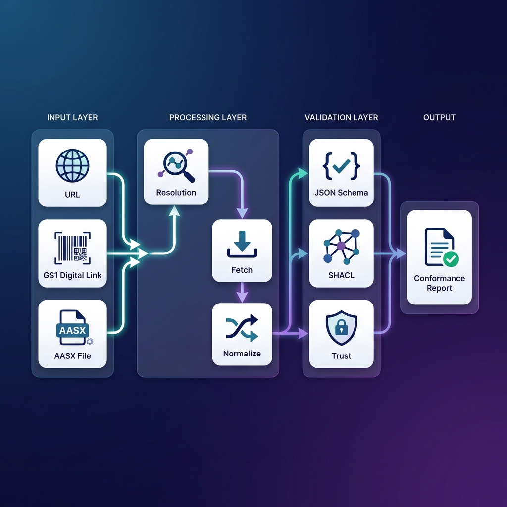

<div align="center">
  <h1>🛡️ OpenDPP Conformance Kit</h1>
  <p><strong>Industrial-Grade Validation for Digital Product Passports & Asset Administration Shells</strong></p>

  <p>
    <a href="https://github.com/hadijannat/opendpp-conformance-kit/actions"></a>
    
    
    
  </p>

  <p>
    <a href="#-quick-start">Quick Start</a> •
    <a href="#-features">Features</a> •
    <a href="#-architecture">Architecture</a> •
    <a href="#-profiles">Profiles</a> •
    <a href="docs/USER_JOURNEY.md">User Journey</a>
  </p>
</div>

---

## 🎯 What is This?

The **OpenDPP Conformance Kit** is a command-line tool and Python library that validates Digital Product Passports (DPP) and Asset Administration Shells (AAS) against regulatory and interoperability standards.

> Think of it as a **linter for your digital twin data** — it checks syntax, semantics, trust anchors, and policy compliance in one unified pipeline.

---

## ✨ Features

| Capability | Description |
| :--- | :--- |
| **🔗 Multi-Input Resolution** | Accepts URLs, GS1 Digital Links, DID URLs, and local AASX files. |
| **📜 JSON Schema Validation** | Validates DPP payloads against sector-specific schemas (e.g., BatteryPass). |
| **🧠 Semantic Validation (SHACL)** | Expands JSON-LD to RDF and runs W3C SHACL constraint checks. |
| **🏭 AAS Integration** | Native support for AASX packages and `aas-core3.0` SDK. |
| **🔐 Trust Verification** | Verifies W3C Verifiable Credentials (VC-JWT) via `did:web`. |
| **📋 Audit-Grade Reports** | Produces `report.json` and `report.html` with evidence hashes for traceability. |

---

## 🚀 Quick Start

### Installation

```bash
pip install opendpp-conformance-kit
```

### Validate a DPP Endpoint

```bash
dppctl check https://example.com/dpp/battery/12345 --profile espr-core
```

### Validate a Local AASX File

```bash
dppctl check ./my_product_twin.aasx --profile espr-core
```

### Output

```
✔ Input recognized as: URL
✔ Fetched artifact: dpp_payload (sha256: a3b8...)
✔ Report generated: report.json

CONFORMANCE PASSED
```

---

## 🏗️ Architecture

<div align="center">
  
</div>

---

## 📦 Profiles

Validation logic is driven by **Profile Packs** — self-contained folders with schemas, SHACL shapes, and policy rules.

| Profile | Description |
| :--- | :--- |
| `espr-core` | Generic ESPR (EU Ecodesign Regulation) baseline checks. |
| `battery-pass` | Multi-aspect BatteryPass validation (GeneralProductInformation, PerformanceAndDurability, Circularity, MaterialComposition, CarbonFootprintForBatteries, SupplyChainDueDiligence, Labeling). |

### Custom Profiles

Create your own in `profiles/my-profile/`:

```
profiles/my-profile/
├── profile.yaml
├── schemas/
├── shapes/
└── rules/
```

---

## 📚 Standards Alignment

This project is built on and aligned with:

- 🇪🇺 **ESPR** – Ecodesign for Sustainable Products Regulation ([EUR-Lex](https://eur-lex.europa.eu/eli/reg/2024/1781/oj))
- 🔗 **GS1 Digital Link** – Identifier resolution ([gs1.org](https://www.gs1.org/standards/gs1-digital-link))
- 🏭 **IDTA AAS** – Asset Administration Shell Metamodel & AASX ([industrialdigitaltwin.org](https://industrialdigitaltwin.org/))
- 🛡️ **W3C VC 2.0 & DID Core** – Verifiable Credentials ([w3.org](https://www.w3.org/TR/vc-data-model-2.0/))
- ✅ **W3C SHACL** – Shapes Constraint Language ([w3.org](https://www.w3.org/TR/shacl/))
- 🔋 **BatteryPass** – Sector-specific data model ([GitHub](https://github.com/batterypass/BatteryPassDataModel))

---

## 🛠️ Development

```bash
# Clone
git clone https://github.com/hadijannat/opendpp-conformance-kit.git
cd opendpp-conformance-kit

# Install in editable mode
pip install -e .

# Run tests
pytest tests/
```

---

## 🤝 Contributing

Contributions are welcome! Please see [CONTRIBUTING.md](CONTRIBUTING.md) for guidelines.

---

## 📄 License

Apache 2.0 – See [LICENSE](LICENSE) for details.

---

<div align="center">
  <sub>Built for Industrial Digital Twins • Standards-First • Audit-Ready</sub>
</div>
