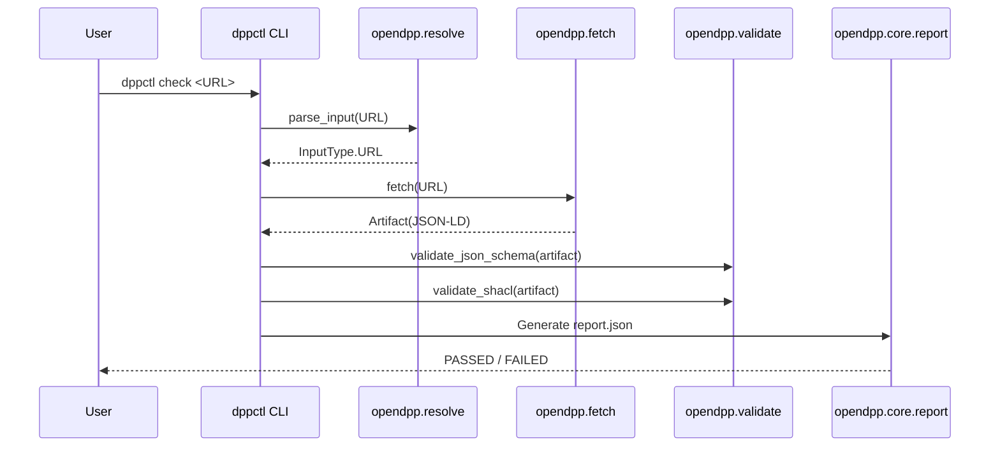

# OpenDPP Conformance Kit - User Journey

This document walks you through the complete user journey for the OpenDPP Conformance Kit, from installation to advanced validation scenarios.

---

## 1. Getting Started

### Installation

```bash
# Clone the repository
git clone https://github.com/hadijannat/opendpp-conformance-kit.git
cd opendpp-conformance-kit

# Install the package
pip install -e .

# Verify installation
dppctl --help
```

**Expected output:**
```
Usage: dppctl [OPTIONS] COMMAND [ARGS]...

  OpenDPP Conformance Kit CLI (dppctl)

Commands:
  check  Runs a conformance check against a target (URL, DID, File).
```

---

## 2. Basic Conformance Check (URL)

The most common use case is validating a DPP endpoint hosted on the web.

```bash
dppctl check https://example.com/dpp/battery/12345 --profile espr-core
```

**What happens under the hood:**



---

## 3. Validating a GS1 Digital Link

Industrial DPPs often use GS1 Digital Links as identifiers. The kit automatically recognizes these.

```bash
dppctl check https://id.gs1.org/01/01234567890128/21/SER123 --profile battery-pass
```

**Recognition logic (from `opendpp.resolve.parse_input`):**
- The URL is scanned for GS1 Application Identifier (AI) segments like `/01/`, `/21/`, `/10/`.
- If found, `InputType.DIGITAL_LINK` is returned.
- AI attributes are extracted via `parse_digital_link_attributes()`.

---

## 4. Validating an AASX File (Industrial Digital Twin)

For industrial systems using Asset Administration Shells, you can validate an AASX package directly.

```bash
dppctl check ./my_product_twin.aasx --profile espr-core
```

**What happens:**
1.  **File Recognition**: `parse_input` detects the `.aasx` extension → `InputType.FILE_PATH`.
2.  **AASX Extraction**: The `opendpp.twin.aas.aasx.extract_aasx()` function unzips the package and extracts AAS environment files (`.json`, `.xml`).
3.  **AAS Parsing**: Each extracted file is parsed using the `aas-core3.0` SDK.
4.  **RDF Mapping**: The `aas_to_rdf()` function converts key AAS structures (Shells, Submodels) into an RDF graph.
5.  **Validation**: This graph is then validated against SHACL shapes defined in the profile.

---

## 5. Verifying a DID-Linked Credential

If your DPP is published as a W3C Verifiable Credential (VC-JWT), the kit can verify its signature.

```bash
dppctl check did:web:example.com:dpp:battery --profile espr-core
```

**Trust Verification Flow:**
1.  **DID Resolution**: The `did:web` is resolved to `https://example.com/dpp/battery/did.json`.
2.  **Key Extraction**: The public key is extracted from the DID Document's `verificationMethod`.
3.  **JWT Verification**: The VC-JWT signature is verified using `joserfc`.
4.  **Claim Validation**: Standard claims like `iss`, `nbf`, and `exp` are checked.

---

## 6. Understanding the Report

Every check produces a `report.json` (and optionally `report.html`).

**Sample `report.json` structure:**

```json
{
  "target": "https://example.com/dpp/12345",
  "profile_id": "espr-core",
  "profile_version": "1.0.0",
  "timestamp": "2026-01-09T12:00:00Z",
  "passed": false,
  "findings": [
    {
      "rule_id": "ESPR-01",
      "severity": "error",
      "message": "DPP must have a unique identifier.",
      "location": "$.id",
      "evidence_links": ["sha256:abc..."]
    }
  ],
  "summary": {
    "total_findings": 1,
    "errors": 1,
    "warnings": 0
  }
}
```

---

## 7. Extending with Custom Profiles

You can create your own validation profile by adding a new folder to `profiles/`.

**Directory structure:**
```
profiles/
└── my-custom-profile/
    ├── profile.yaml       # Manifest
    ├── schemas/
    │   └── my_schema.json # JSON Schema for validation
    ├── shapes/
    │   └── my_shapes.ttl  # SHACL shapes for RDF validation
    └── rules/
        └── policy.yaml    # Data-driven policy rules
```

**Sample `profile.yaml`:**
```yaml
id: my-custom-profile
version: 1.0.0
description: Custom profile for my organization.
entrypoint_media_types:
  - application/json
artifacts:
  schemas:
    - profiles/my-custom-profile/schemas/my_schema.json
  shapes:
    - profiles/my-custom-profile/shapes/my_shapes.ttl
```

---

## 8. Programmatic Use (Python Library)

For CI/CD pipelines or custom tooling, you can import `opendpp` as a library.

```python
from opendpp.core.report import ConformanceReport
from opendpp.resolve.parse_input import parse_input, InputType
from opendpp.fetch.http import HttpFetcher
from opendpp.validate.syntax.json_schema import validate_json_schema

# 1. Initialize report
report = ConformanceReport(target="https://example.com/dpp", profile_id="espr-core", profile_version="1.0.0")

# 2. Resolve and Fetch
input_type, canonical = parse_input("https://example.com/dpp")
if input_type == InputType.URL:
    fetcher = HttpFetcher()
    artifact = fetcher.fetch(canonical)

# 3. Validate (example: JSON Schema)
# schema_artifact = ... load your schema ...
# validate_json_schema(artifact, schema_artifact, report)

# 4. Finalize and export
report.finalize()
print(report.model_dump_json(indent=2))
```

---

## 9. Integration with CI/CD

You can integrate `dppctl` into your GitHub Actions workflow.

```yaml
# .github/workflows/dpp-conformance.yml
name: DPP Conformance Check
on: [push]

jobs:
  validate:
    runs-on: ubuntu-latest
    steps:
      - uses: actions/checkout@v4
      - name: Set up Python
        uses: actions/setup-python@v5
        with:
          python-version: '3.12'
      - name: Install dppctl
        run: pip install opendpp-conformance-kit
      - name: Run Conformance Check
        run: dppctl check ./sample_dpp.json --profile espr-core --output report.json
      - name: Upload Report
        uses: actions/upload-artifact@v4
        with:
          name: conformance-report
          path: report.json
```

---

## Summary of Entry Points

| Use Case | Command |
| :--- | :--- |
| Validate a URL | `dppctl check <URL> --profile espr-core` |
| Validate a GS1 Digital Link | `dppctl check <DIGITAL_LINK_URL> --profile battery-pass` |
| Validate an AASX file | `dppctl check ./file.aasx --profile espr-core` |
| Validate a DID-based VC | `dppctl check did:web:... --profile espr-core` |
| Programmatic use | `from opendpp import ...` |
